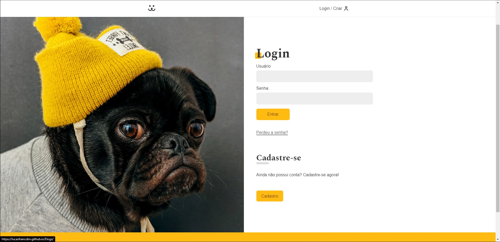
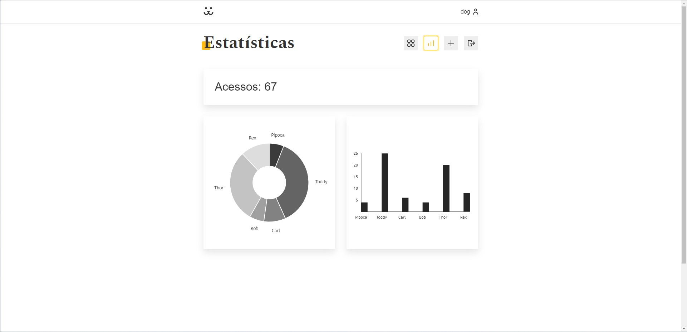

<h1>🐶 Dogs 🐶</h1>

<!-- LINKS -->

 <h2> Sumário</h2>
  <a href="#fotos">Fotos</a> -
  <a href="#sobre">Sobre o Projeto</a> - 
  <a href="#tec">Tecnologias</a>

 

<!-- FOTOS -->

    <h2> 📸 Fotos </h2>
        
          
        
          
       
 <h2> 📱 Responsivo </h2>
    
          

<!-- SOBRE -->

    <h2> 📝 Sobre o Projeto </h2> 
    

      Dogs é uma rede social de cachorros, onde os usuários podem criar conta, postar e deletar fotos, comentar em fotos e ver as estátisticas de suas fotos postadas.
      Projeto foi feito utilizando diversas técnologias, libs e integração com a API REST do projeto.
    

 

<!-- TECNOLOGIAS -->

<h2> 🖥️ Tecnologias</h2>
    
 ✔️ ReactJS 

    
 ✔️ React Router DOM 

    
 ✔️ Modules CSS 

    
 ✔️ Victory 

    
 ✔️ Vite 

